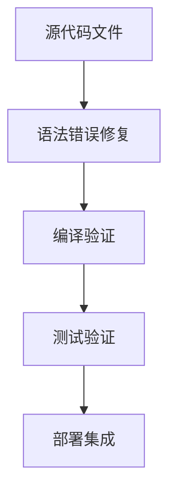
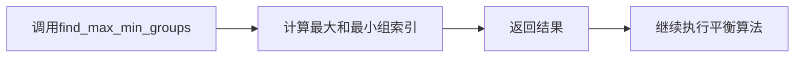

# 修复三相平衡算法语法错误 - 设计文档

## 1. 整体架构
本次修复不涉及架构变更，仅针对现有代码中的语法错误进行修正。

## 2. 分层设计和核心组件
- **代码层**：`src/core_lib/algorithm/three_phase_balance.rs` - 包含三相平衡算法的实现
  - 受影响组件：`ThreePhaseBalancer` 结构体的方法实现
  - 具体错误位置：第71行语句缺少分号

## 3. 模块依赖关系
- 该文件依赖于：
  - `core_lib/error.rs` - 用于错误处理
  - Rust标准库 - 用于基本类型和功能

## 4. 接口契约定义
- 本次修复不涉及接口变更
- `find_max_min_groups()` 方法的签名和行为保持不变
  - 输入：无
  - 输出：`Result<(usize, usize)>`

## 5. 数据流向图
- 修复前：代码语法错误导致编译失败，无法执行
- 修复后：代码可正常编译，数据流向保持不变

## 6. 异常处理策略
- `find_max_min_groups()` 方法返回 `Result` 类型
- 使用 `?` 操作符正确传播错误
- 修复确保错误处理机制正常工作

## 7. 实现细节
- **修改位置**：`src/core_lib/algorithm/three_phase_balance.rs` 第71行
- **修改内容**：添加缺失的分号
- **修改原因**：在Rust中，语句必须以分号结束（除了表达式返回值的情况）

## 8. 验证计划
1. 执行 `cargo check` 确认编译通过
2. 执行 `cargo test` 确认所有测试通过
3. 确保修复不影响其他功能

## 9. 风险评估
- **风险级别**：低
- **潜在风险**：几乎为零，这是一个简单的语法修复
- **缓解措施**：修复后进行完整的编译和测试验证