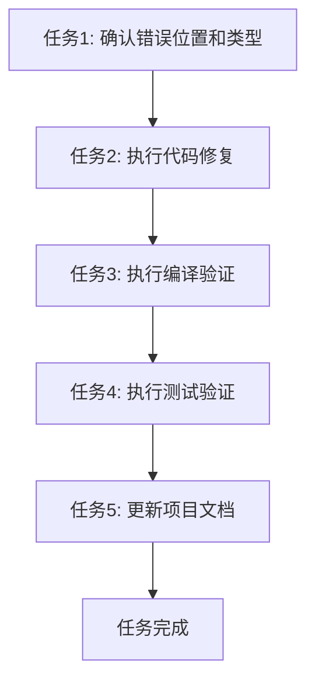

# 修复三相平衡算法语法错误 - 任务拆分文档

## 1. 任务概述
本任务旨在修复 `src/core_lib/algorithm/three_phase_balance.rs` 文件第71行的语法错误，确保代码可以正常编译和运行。

## 2. 任务拆分

### 任务1: 确认错误位置和类型
- **输入契约**：
  - 目标文件：`src/core_lib/algorithm/three_phase_balance.rs`
  - 错误行：第71行
- **输出契约**：
  - 错误确认：缺少语句结束的分号
  - 修复方案确认：在第71行末尾添加分号
- **实现约束**：
  - 仔细检查代码上下文
  - 确认错误类型
- **依赖关系**：
  - 前置任务：无
  - 后置任务：执行代码修复
- **测试用例**：
  - 验证错误确实是缺少分号导致的编译失败

### 任务2: 执行代码修复
- **输入契约**：
  - 已确认的错误位置和类型
  - 修复方案
- **输出契约**：
  - 修改后的源代码文件
  - 修复记录
- **实现约束**：
  - 严格按照修复方案执行，只添加分号
  - 不修改其他代码行
- **依赖关系**：
  - 前置任务：确认错误位置和类型
  - 后置任务：执行编译验证
- **测试用例**：
  - 视觉检查修改后的代码

### 任务3: 执行编译验证
- **输入契约**：
  - 修复后的源代码文件
- **输出契约**：
  - 编译检查结果
- **实现约束**：
  - 执行 `cargo check` 命令
  - 验证无编译错误
- **依赖关系**：
  - 前置任务：执行代码修复
  - 后置任务：执行测试验证
- **测试用例**：
  - 编译命令输出无错误信息

### 任务4: 执行测试验证
- **输入契约**：
  - 通过编译检查的代码
- **输出契约**：
  - 测试执行结果
- **实现约束**：
  - 执行 `cargo test` 命令
  - 验证所有测试通过
- **依赖关系**：
  - 前置任务：执行编译验证
  - 后置任务：更新文档
- **测试用例**：
  - 所有测试用例成功通过

### 任务5: 更新项目文档
- **输入契约**：
  - 修复完成的确认
  - 测试通过的确认
- **输出契约**：
  - 更新的项目文档
  - 修复记录
- **实现约束**：
  - 按照项目文档规范更新
  - 记录修复的详细信息
- **依赖关系**：
  - 前置任务：执行测试验证
  - 后置任务：完成任务
- **测试用例**：
  - 文档格式符合项目规范
  - 修复信息记录完整

## 3. 任务依赖图

## 4. 复杂度评估
- **整体复杂度**：低
- **技术复杂度**：极低，仅涉及简单的语法修复
- **风险评估**：几乎无风险，修复方案明确且影响范围可控

## 5. 验收标准
- 所有子任务按照依赖顺序完成
- 编译检查通过，无错误
- 所有测试用例成功通过
- 文档更新完成，记录完整

## 6. 时间估计
- **总时间估计**：约1小时
  - 任务1: 10分钟
  - 任务2: 5分钟
  - 任务3: 15分钟
  - 任务4: 15分钟
  - 任务5: 15分钟