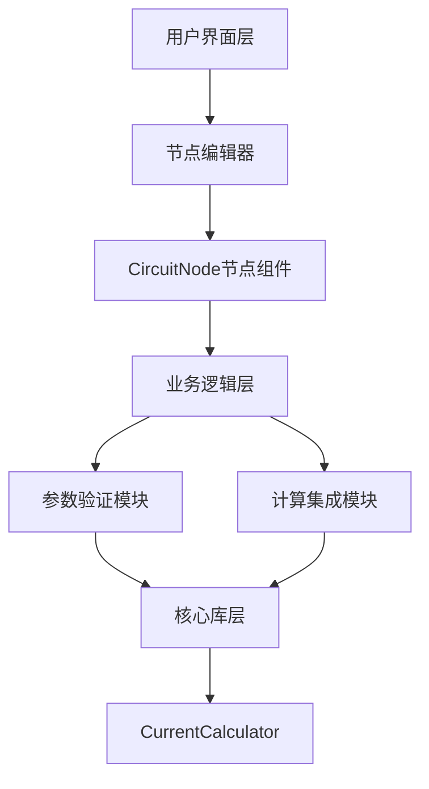
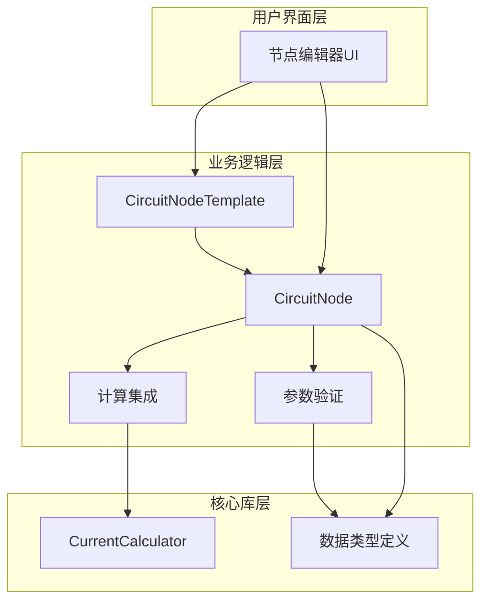
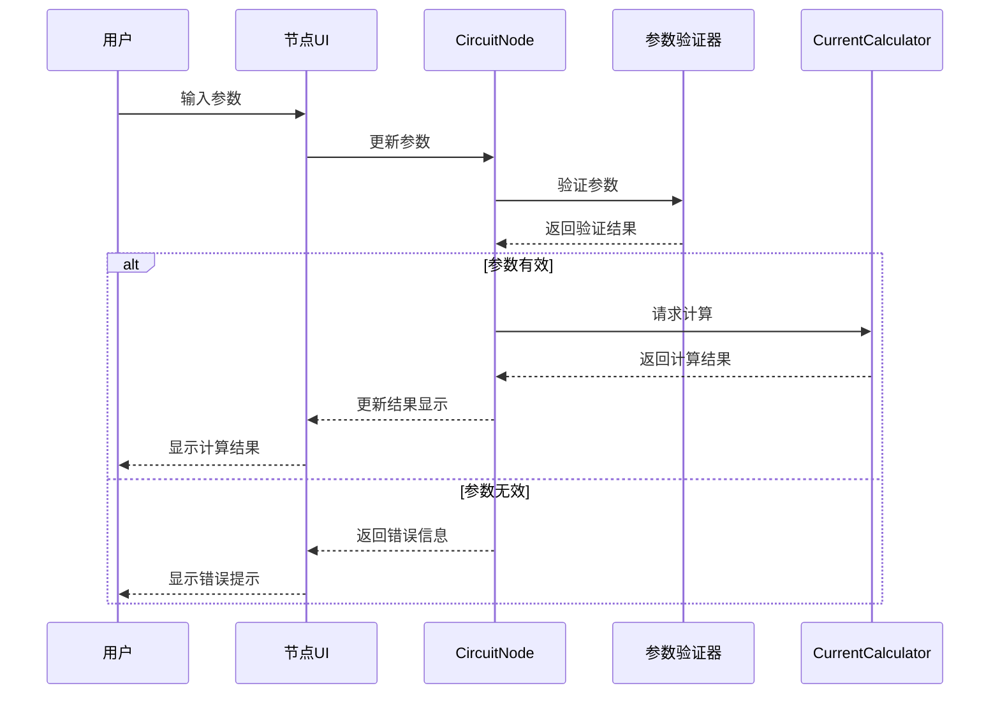
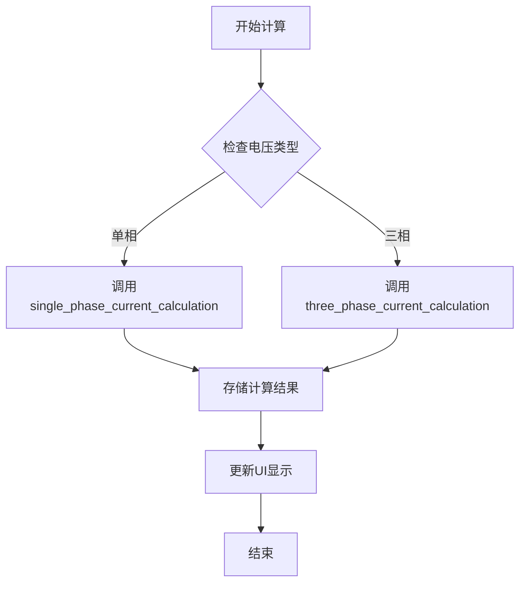

# 开发配电回路节点 - 架构设计文档

## 1. 整体架构图



## 2. 分层设计和核心组件

### 2.1 用户界面层

- **节点编辑器集成**：将CircuitNode集成到egui_node_graph框架中
- **节点UI组件**：实现参数输入、结果显示等UI元素
- **交互处理**：处理用户输入和界面更新

### 2.2 业务逻辑层

- **CircuitNode结构体**：实现NodeDataTrait接口
- **CircuitNodeTemplate结构体**：实现NodeTemplateTrait接口
- **参数验证模块**：确保输入参数的有效性
- **计算集成模块**：连接UI和计算核心

### 2.3 核心库层

- **CurrentCalculator**：提供电流计算功能
- **数据类型定义**：定义各种数据类型和转换规则

## 3. 模块依赖关系图



## 4. 接口契约定义

### 4.1 CircuitNode 结构体

```rust
pub struct CircuitNode {
    // 节点标识和元数据
    pub id: String,
    
    // 回路参数
    pub parameters: CircuitParameters,
    
    // 计算结果
    pub result: Option<CircuitResult>,
}

impl NodeDataTrait for CircuitNode {
    // 实现接口方法
    // ...
}
```

### 4.2 CircuitParameters 结构体

```rust
pub struct CircuitParameters {
    pub name: String,
    pub pe: f32,          // 额定功率
    pub kx: f32,          // 需要系数
    pub cos: f32,         // 功率因数
    pub voltage_type: VoltageType, // 电压类型
}

pub enum VoltageType {
    SinglePhase,
    ThreePhase,
}
```

### 4.3 CircuitResult 结构体

```rust
pub struct CircuitResult {
    pub ijs: f32,         // 计算电流
    pub voltage: f32,     // 电压值
    pub calculation_time: Instant, // 计算时间戳
}
```

### 4.4 CircuitNodeTemplate 结构体

```rust
pub struct CircuitNodeTemplate {
    // 模板配置
}

impl NodeTemplateTrait for CircuitNodeTemplate {
    // 实现接口方法
    // ...
}
```

## 5. 数据流向图



## 6. 异常处理策略

### 6.1 参数验证错误

- 当参数超出有效范围时，显示错误提示
- 阻止无效计算，保持上一次有效计算结果
- 提供参数范围提示

### 6.2 计算错误

- 捕获计算过程中可能出现的数值错误（如除以零）
- 提供友好的错误消息
- 记录错误日志，便于调试

### 6.3 连接错误

- 验证节点连接的兼容性
- 当连接不兼容时显示错误提示
- 提供连接建议

## 7. 节点类型和连接规则设计

### 7.1 节点端口定义

- **输入端口**：
  - 可选的上游电源信息

- **输出端口**：
  - 回路计算结果（包含电流值等）
  - 回路参数信息

### 7.2 连接规则

- 输出端口可连接到配电箱节点的输入端口
- 可从电源节点接收输入
- 连接时验证数据类型兼容性

## 8. 电气计算流程设计



## 9. 实现考虑事项

### 9.1 Rust设计模式应用

- **数据导向设计**：将数据和行为分离
- **借用和所有权**：正确使用Rust的所有权模型
- **错误处理**：使用Result类型和thiserror库

### 9.2 性能优化

- **惰性计算**：仅在参数变化时重新计算
- **缓存结果**：缓存计算结果，避免重复计算
- **UI更新优化**：避免不必要的UI重绘

### 9.3 可扩展性

- **模块化设计**：便于未来扩展功能
- **接口抽象**：通过trait实现功能扩展
- **配置驱动**：关键参数可配置，便于调整

## 10. 代码组织

- `src/editor/business/circuit_node.rs`：节点核心实现
- `src/editor/business/circuit_parameters.rs`：参数定义和验证
- `src/editor/graph/node_templates.rs`：节点模板定义
- `src/editor/ui/circuit_node_ui.rs`：节点UI实现
- `tests/unit/circuit_node_tests.rs`：单元测试