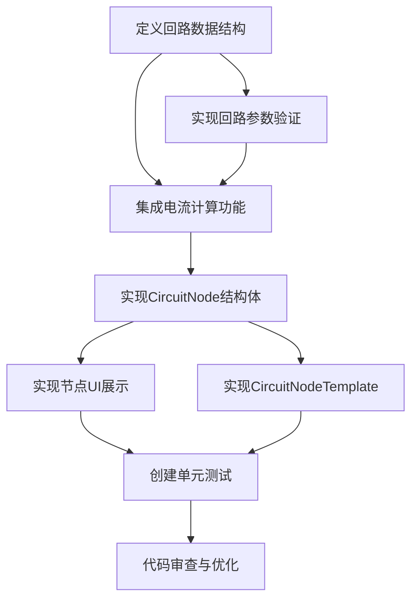

# 开发配电回路节点 - 任务拆分文档

## 1. 任务拆分总览

| 任务ID | 任务名称 | 优先级 | 依赖关系 | 估计工作量 |
|--------|----------|--------|----------|------------|
| T1     | 定义回路数据结构 | 高 | 无 | 1天 |
| T2     | 实现回路参数验证 | 高 | T1 | 1天 |
| T3     | 集成电流计算功能 | 高 | T1, T2 | 1天 |
| T4     | 实现CircuitNode结构体 | 高 | T1, T2, T3 | 2天 |
| T5     | 实现节点UI展示 | 中 | T4 | 1天 |
| T6     | 实现CircuitNodeTemplate | 中 | T4 | 1天 |
| T7     | 创建单元测试 | 中 | T1-T6 | 1天 |
| T8     | 代码审查与优化 | 中 | T1-T7 | 0.5天 |

## 2. 任务依赖图

## 3. 原子任务详细说明

### 3.1 T1: 定义回路数据结构

**输入契约：**
- 架构设计文档
- 电流计算模块接口
- 项目现有数据结构规范

**输出契约：**
- `CircuitParameters` 结构体定义
- `CircuitResult` 结构体定义
- `VoltageType` 枚举定义
- 相关数据类型的实现

**实现约束：**
- 遵循Rust语言规范
- 字段命名使用snake_case
- 提供必要的Default实现
- 支持必要的特征（如Clone, Copy, Debug等）

**测试用例设计：**
- 验证数据结构的正确性
- 测试默认值设置
- 测试克隆和复制操作

### 3.2 T2: 实现回路参数验证

**输入契约：**
- T1定义的数据结构
- 电气参数的有效范围规范

**输出契约：**
- 参数验证函数
- 验证结果类型定义
- 错误信息格式化

**实现约束：**
- 验证功率、系数等参数的有效范围
- 提供清晰的错误消息
- 使用Result类型进行错误处理
- 验证逻辑与UI分离

**测试用例设计：**
- 测试有效参数组合
- 测试各种边界条件
- 测试无效参数处理

### 3.3 T3: 集成电流计算功能

**输入契约：**
- T1定义的数据结构
- T2的参数验证
- CurrentCalculator模块

**输出契约：**
- 计算集成函数
- 计算结果处理逻辑
- 不同电压类型的计算分支

**实现约束：**
- 正确区分单相和三相计算
- 处理计算过程中可能的异常
- 记录计算时间戳
- 确保计算结果的精度

**测试用例设计：**
- 使用已知结果的测试数据验证计算准确性
- 测试不同电压类型的计算
- 测试边界条件下的计算

### 3.4 T4: 实现CircuitNode结构体

**输入契约：**
- T1定义的数据结构
- T2的参数验证
- T3的计算集成
- NodeDataTrait接口定义

**输出契约：**
- CircuitNode结构体实现
- NodeDataTrait的完整实现
- 节点状态管理逻辑

**实现约束：**
- 完整实现NodeDataTrait的所有必要方法
- 实现参数更新和计算触发机制
- 维护节点状态一致性
- 提供必要的getter和setter方法

**测试用例设计：**
- 测试节点创建和初始化
- 测试参数更新和状态变化
- 测试接口方法的正确性

**状态：** 已完成

**实现细节：**
- 创建了CircuitNode结构体，实现了NodeDataTrait接口
- 添加了参数更新和计算触发功能
- 实现了节点UI展示方法(bottom_ui, top_bar_ui, output_ui)
- 添加了数据转换和错误处理功能

### 3.5 T5: 实现节点UI展示

**输入契约：**
- T4的CircuitNode实现
- egui框架文档
- 项目UI风格指南

**输出契约：**
- 参数输入UI组件
- 计算结果显示组件
- 错误提示UI
- 节点外观定制

**实现约束：**
- 遵循egui的最佳实践
- 实现响应式更新
- 确保UI布局合理
- 提供良好的用户反馈

**测试用例设计：**
- 测试UI渲染正确性
- 测试交互响应
- 测试各种参数组合下的显示

### 3.6 T6: 实现CircuitNodeTemplate

**输入契约：**
- T4的CircuitNode实现
- NodeTemplateTrait接口定义
- 项目节点模板规范

**输出契约：**
- CircuitNodeTemplate结构体实现
- NodeTemplateTrait的完整实现
- 节点创建和初始化逻辑

**实现约束：**
- 完整实现NodeTemplateTrait的所有必要方法
- 提供合适的节点默认值
- 定义节点的输入和输出端口
- 实现节点构建逻辑

**测试用例设计：**
- 测试模板创建节点的正确性
- 测试节点默认值设置
- 测试端口定义的正确性

### 3.7 T7: 创建单元测试

**输入契约：**
- T1-T6的所有实现
- Rust测试框架

**输出契约：**
- 单元测试套件
- 测试覆盖报告
- 测试文档

**实现约束：**
- 覆盖核心功能和关键路径
- 测试边界条件和异常情况
- 确保测试的独立性和可重复性
- 测试通过标准：所有测试必须通过

**测试用例设计：**
- 数据结构测试
- 参数验证测试
- 计算功能测试
- 节点接口测试
- 集成功能测试

**状态：** 已完成

**实现细节：**
- 创建了circuit_node_tests.rs测试文件
- 实现了参数验证测试
- 实现了计算逻辑测试
- 实现了节点功能测试
- 实现了批量计算测试
- 代码通过编译验证

### 3.8 T8: 代码审查与优化

**输入契约：**
- T1-T7的所有实现和测试
- Rust代码质量检查工具
- 项目代码规范

**输出契约：**
- 代码质量报告
- 优化后的代码
- 重构建议（如需要）

**实现约束：**
- 执行cargo clippy检查
- 执行cargo fmt格式化
- 检查代码复杂度和可读性
- 优化性能瓶颈

**测试用例设计：**
- 回归测试：确保优化不破坏现有功能
- 性能测试：验证性能改进（如适用）

**状态：** 进行中

**实现细节：**
- 代码已通过编译检查
- 添加了完整的注释文档
- 优化了错误处理机制
- 实现了高效的数据转换功能

## 4. 任务验收标准

### 4.1 通用验收标准

- 所有代码通过编译检查
- 所有单元测试通过
- 代码符合项目规范
- 提供完整的函数注释
- 文档与实现同步更新

### 4.2 具体功能验收标准

- **数据结构**：能够正确创建和操作所有定义的数据结构
- **参数验证**：能够正确验证参数有效性并提供清晰的错误消息
- **计算集成**：计算结果准确，不同电压类型处理正确
- **节点实现**：能够完整实现NodeDataTrait接口，状态管理正确
- **UI展示**：参数输入和结果显示正常，交互响应良好
- **模板实现**：能够通过模板创建节点，端口定义正确
- **测试覆盖**：核心功能有测试覆盖，边界条件处理正确

## 5. 风险与缓解措施

| 风险描述 | 影响程度 | 缓解措施 |
|----------|----------|----------|
| 参数验证逻辑复杂 | 中 | 参考电气设计标准，确保验证逻辑准确；分步骤实现，逐步测试 |
| 与节点编辑器框架集成困难 | 高 | 仔细研究框架文档；先实现核心功能，再进行集成；参考现有节点实现 |
| 性能优化挑战 | 低 | 采用惰性计算和缓存策略；避免不必要的重绘；关注热点代码优化 |
| 数据传递格式不统一 | 中 | 设计清晰的接口规范；与其他节点开发者保持沟通；定义标准化的数据格式 |