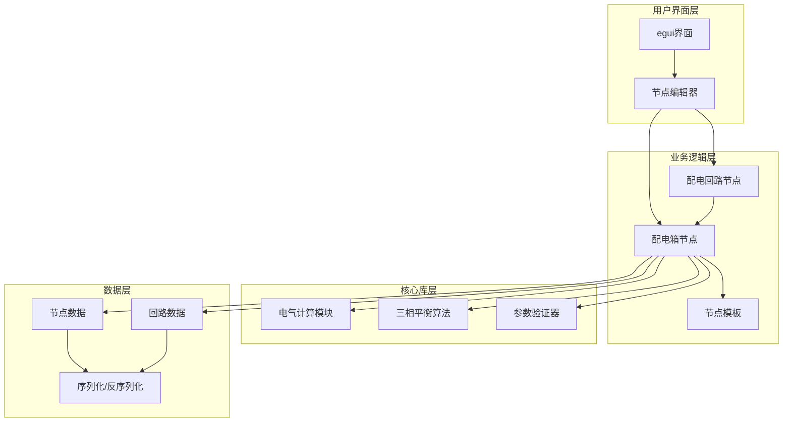
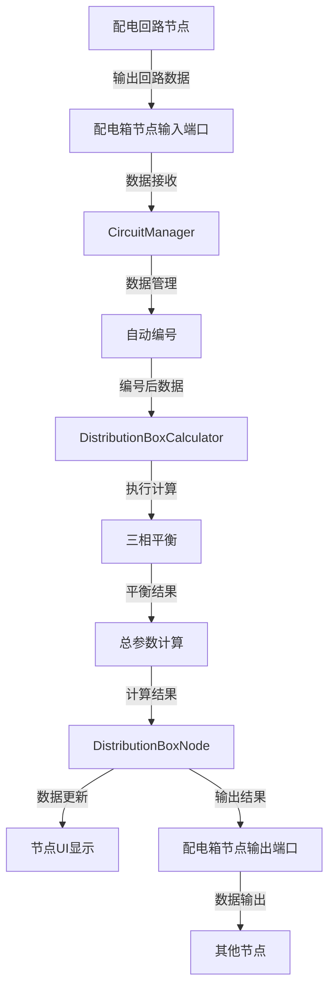
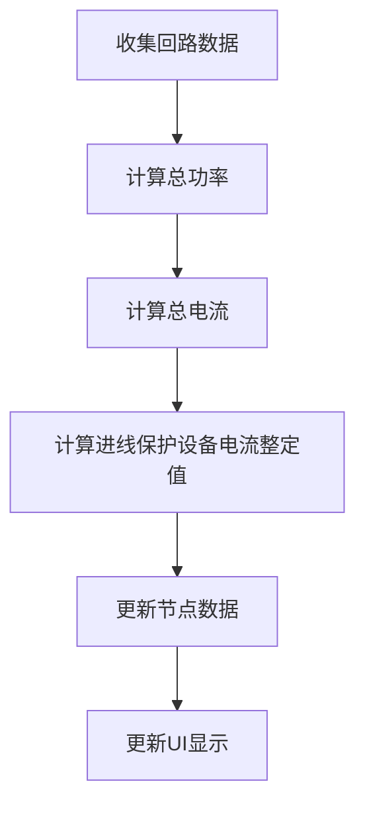
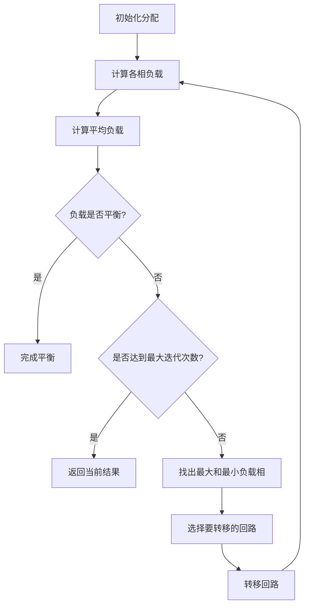
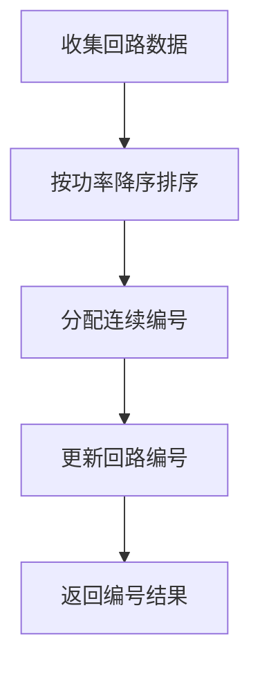

# 开发配电箱节点 - 系统设计文档

## 1. 整体架构设计

### 1.1 架构概述

配电箱节点作为PDSD系统的核心组件之一，负责管理配电回路和实现三相平衡功能。整体架构遵循项目的分层设计原则，与现有系统无缝集成。



### 1.2 分层设计

1. **用户界面层**：
   - 基于egui框架实现节点编辑器界面
   - 负责用户交互和数据展示
   - 集成配电箱节点的可视化组件

2. **业务逻辑层**：
   - 实现配电箱节点的核心功能
   - 管理回路数据和关系
   - 处理节点间的数据传递

3. **核心库层**：
   - 提供电气计算功能
   - 实现三相平衡算法
   - 负责参数验证

4. **数据层**：
   - 管理节点和回路数据
   - 实现数据序列化和反序列化
   - 确保数据一致性

## 2. 模块设计

### 2.1 核心模块

#### 2.1.1 DistributionBoxNode

**功能**：实现配电箱节点的核心数据结构和功能

**主要组件**：
- 基础属性管理（名称、楼层等）
- 回路集合管理
- 三相负载计算和平衡
- 总参数计算

**实现文件**：`src/editor/business/distribution_box_node.rs`

#### 2.1.2 DistributionBoxTemplate

**功能**：定义配电箱节点的模板，用于在节点编辑器中创建新节点

**主要组件**：
- 节点类型定义
- 端口配置
- 默认参数设置
- 节点创建逻辑

**实现文件**：`src/editor/business/distribution_box_template.rs`

#### 2.1.3 DistributionBoxCalculator

**功能**：提供配电箱相关的计算功能

**主要组件**：
- 总功率计算
- 总电流计算
- 进线保护设备选型
- 三相平衡算法

**实现文件**：`src/editor/business/distribution_box_calculator.rs`

#### 2.1.4 CircuitManager

**功能**：管理回路数据和关系

**主要组件**：
- 回路添加/删除/更新
- 回路排序
- 自动编号
- 数据验证

**实现文件**：`src/editor/business/circuit_manager.rs`

### 2.2 依赖关系图

```mermaid
digraph TD
    DistBoxNode --> DistBoxCalculator
    DistBoxNode --> CircuitManager
    DistBoxTemplate --> DistBoxNode
    DistBoxCalculator --> BalanceAlgo
    DistBoxCalculator --> CurrentCalc
    CircuitManager --> Validator
    NodeEditor --> DistBoxTemplate
    NodeEditor --> DistBoxNode
```

## 3. 接口规范

### 3.1 外部接口

#### 3.1.1 NodeDataTrait 实现

```rust
impl NodeDataTrait for DistributionBoxNode {
    type Response = DistributionBoxResponse;
    type UserState = EditorState;
    type DataType = ElectricDataType;
    type ValueType = ElectricValueType;
    
    // 节点UI渲染方法
    fn bottom_ui(&self, ui: &mut egui::Ui, node_id: NodeId, graph: &Graph<Self, Self::DataType, Self::ValueType>, user_state: &mut Self::UserState) -> Vec<NodeResponse<Self::Response, Self>>;
    
    // 节点参数更新方法
    fn update_params(&mut self, params: Self::ValueType, _user_state: &mut Self::UserState) -> Result<(), Self::DataType>;
    
    // 数据输入处理方法
    fn input_data(&mut self, input_idx: usize, data: &Self::DataType, _user_state: &mut Self::UserState) -> Result<(), Self::DataType>;
    
    // 数据输出方法
    fn output_data(&self, output_idx: usize, _user_state: &Self::UserState) -> Result<Self::DataType, Self::DataType>;
}
```

#### 3.1.2 NodeTemplateTrait 实现

```rust
impl NodeTemplateTrait for DistributionBoxTemplate {
    type NodeData = DistributionBoxNode;
    type DataType = ElectricDataType;
    type ValueType = ElectricValueType;
    type UserState = EditorState;
    
    // 获取节点类别
    fn node_category(&self) -> &str;
    
    // 获取节点名称
    fn node_name(&self) -> &str;
    
    // 创建节点实例
    fn create_node(&self, _user_state: &mut Self::UserState) -> Self::NodeData;
    
    // 获取输入端口配置
    fn input_types(&self) -> Vec<(&str, Self::DataType)>;
    
    // 获取输出端口配置
    fn output_types(&self) -> Vec<(&str, Self::DataType)>;
}
```

### 3.2 内部接口

#### 3.2.1 DistributionBoxCalculator 接口

```rust
pub struct DistributionBoxCalculator;

impl DistributionBoxCalculator {
    // 计算总功率
    pub fn calculate_total_power(circuits: &[CircuitInfo]) -> f64;
    
    // 计算总电流
    pub fn calculate_total_current(total_power: f64, power_factor: f64) -> f64;
    
    // 计算进线保护设备电流整定值
    pub fn calculate_incoming_current(total_current: f64) -> f64;
    
    // 执行三相平衡
    pub fn balance_three_phases(circuits: &mut [CircuitInfo]) -> Result<[f64; 3], DistributionBoxError>;
}
```

#### 3.2.2 CircuitManager 接口

```rust
pub struct CircuitManager;

impl CircuitManager {
    // 添加回路
    pub fn add_circuit(circuits: &mut Vec<CircuitInfo>, circuit: CircuitInfo) -> Result<(), DistributionBoxError>;
    
    // 删除回路
    pub fn remove_circuit(circuits: &mut Vec<CircuitInfo>, circuit_id: &str) -> Result<(), DistributionBoxError>;
    
    // 更新回路
    pub fn update_circuit(circuits: &mut Vec<CircuitInfo>, circuit: CircuitInfo) -> Result<(), DistributionBoxError>;
    
    // 自动编号
    pub fn auto_number_circuits(circuits: &mut [CircuitInfo]);
    
    // 验证回路数据
    pub fn validate_circuit(circuit: &CircuitInfo) -> Result<(), DistributionBoxError>;
}
```

## 4. 数据流向设计

### 4.1 数据流图



### 4.2 数据处理流程

1. **数据接收阶段**：
   - 从配电回路节点接收回路数据
   - 验证数据有效性
   - 更新内部回路集合

2. **数据处理阶段**：
   - 执行自动编号
   - 执行三相平衡算法
   - 计算总功率和总电流
   - 确定进线保护设备电流整定值

3. **数据输出阶段**：
   - 更新节点数据和状态
   - 更新UI显示
   - 输出结果到其他节点

## 5. 异常处理策略

### 5.1 错误类型定义

```rust
#[derive(Debug, thiserror::Error)]
pub enum DistributionBoxError {
    #[error("回路数量超出限制: {0}个回路，最大允许99个")]
    CircuitCountExceeded(u32),
    
    #[error("参数无效: {0}")]
    InvalidParameter(String),
    
    #[error("三相平衡失败，达到最大迭代次数")]
    BalanceFailed,
    
    #[error("计算错误: {0}")]
    CalculationError(String),
    
    #[error("回路不存在: {0}")]
    CircuitNotFound(String),
    
    #[error("数据序列化错误: {0}")]
    SerializationError(String),
}
```

### 5.2 错误处理流程

1. **参数验证**：
   - 输入参数验证
   - 边界条件检查
   - 无效参数错误处理

2. **计算错误处理**：
   - 检查计算过程中的异常
   - 处理除零等特殊情况
   - 提供友好的错误信息

3. **UI错误展示**：
   - 在节点UI中显示错误信息
   - 使用红色文本高亮错误
   - 提供错误解决建议

4. **数据一致性保护**：
   - 操作失败时回滚数据
   - 确保节点状态一致性
   - 避免部分更新导致的数据异常

## 6. 节点类型和连接规则设计

### 6.1 节点类型定义

- **节点ID**：`distribution_box`
- **节点名称**：配电箱
- **节点类别**：电气节点
- **节点描述**：管理多个配电回路，实现三相平衡和总参数计算

### 6.2 端口配置

#### 6.2.1 输入端口

| 端口索引 | 端口名称 | 数据类型 | 说明 |
|---------|---------|---------|------|
| 0 | 回路输入1 | CircuitData | 接收第一个回路的数据 |
| 1 | 回路输入2 | CircuitData | 接收第二个回路的数据 |
| 2 | 回路输入3 | CircuitData | 接收第三个回路的数据 |
| ... | ... | ... | ... |
| N | 回路输入N | CircuitData | 接收第N个回路的数据 |

**注意**：支持动态端口，最多99个输入端口

#### 6.2.2 输出端口

| 端口索引 | 端口名称 | 数据类型 | 说明 |
|---------|---------|---------|------|
| 0 | 配电箱数据 | DistributionBoxData | 输出完整的配电箱数据 |
| 1 | 总电流 | CurrentValue | 输出总电流值 |
| 2 | 总功率 | PowerValue | 输出总功率值 |
| 3 | 进线电流 | IncomingCurrentValue | 输出进线保护设备电流整定值 |

### 6.3 连接规则

1. **输入连接**：
   - 只能连接配电回路节点的输出端口
   - 每个输入端口最多连接一个回路
   - 支持多个回路节点连接到同一个配电箱节点

2. **输出连接**：
   - 配电箱数据输出可连接到需要完整信息的下游节点
   - 总电流、总功率、进线电流可连接到需要特定参数的下游节点
   - 支持多个下游节点连接到同一个输出端口

## 7. 电气计算流程设计

### 7.1 总参数计算流程



### 7.2 三相平衡计算流程



### 7.3 自动编号流程



## 8. 实现约束和限制

1. **性能约束**：
   - 节点数据更新响应时间 < 100ms
   - 三相平衡算法最大迭代次数为100次
   - 支持的最大回路数量为99个

2. **技术约束**：
   - 必须使用Rust 2024 Edition
   - 必须符合egui_node_graph框架要求
   - 必须与现有数据类型兼容
   - 严格遵循Rust所有权模型

3. **功能限制**：
   - 仅支持三相380V系统
   - 仅计算进线保护设备电流整定值，不包含详细选型
   - 仅支持配电回路节点的数据接收，不支持其他类型节点