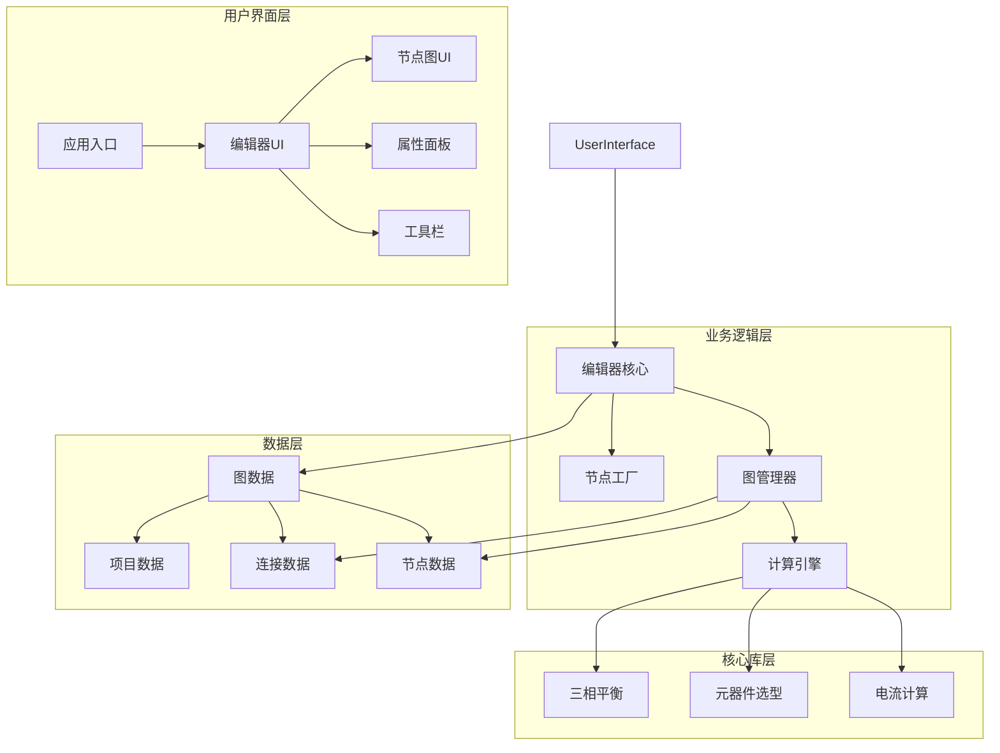
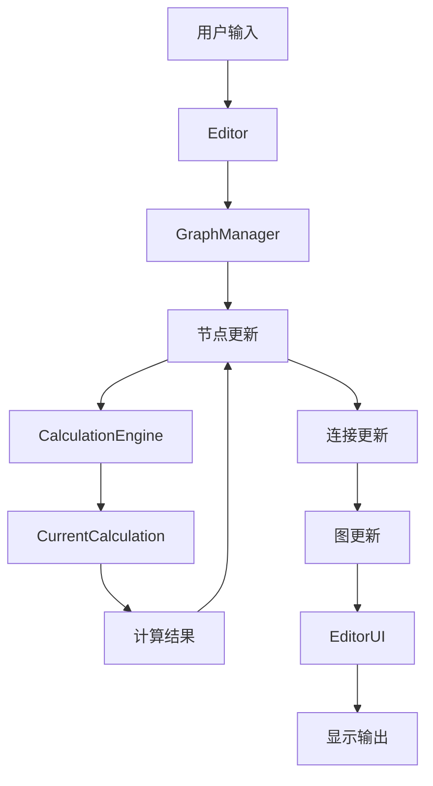
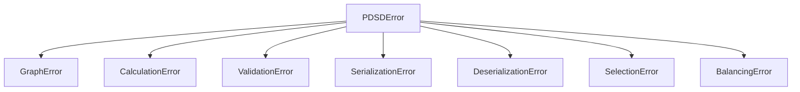
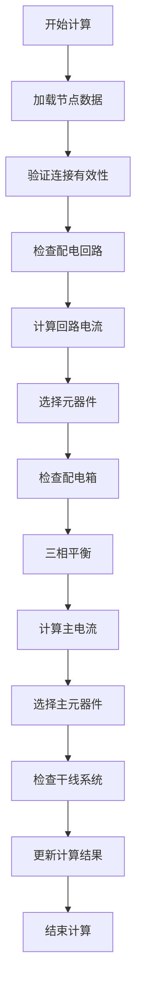

# 系统性完善工作 - 设计文档

## 1. 整体架构图



## 2. 分层设计和核心组件

### 2.1 用户界面层 (UI Layer)

- **应用入口 (App)**: 应用程序的主入口，负责初始化和管理整个应用生命周期
- **编辑器UI (EditorUI)**: 核心用户界面，集成节点图、属性面板和工具栏
- **节点图UI (NodeGraphUI)**: 显示和交互节点图的界面组件
- **属性面板 (PropertyPanel)**: 显示和编辑选中节点或连接的属性
- **工具栏 (Toolbar)**: 提供常用操作和工具的界面组件

### 2.2 业务逻辑层 (Business Logic Layer)

- **编辑器核心 (Editor)**: 处理用户交互和业务逻辑的核心组件
- **图管理器 (GraphManager)**: 管理节点图的结构、节点和连接
- **节点工厂 (NodeFactory)**: 创建和初始化不同类型的节点
- **计算引擎 (CalculationEngine)**: 执行电气计算和验证

### 2.3 核心库层 (Core Library Layer)

- **电流计算 (CurrentCalculation)**: 实现电气电流计算逻辑
- **元器件选型 (ComponentSelection)**: 实现断路器、线缆等元器件的自动选型
- **三相平衡 (ThreePhaseBalancer)**: 实现三相平衡算法

### 2.4 数据层 (Data Layer)

- **图数据 (GraphData)**: 存储整个图的结构数据
- **节点数据 (NodeData)**: 存储各个节点的数据和属性
- **连接数据 (ConnectionData)**: 存储节点间的连接数据
- **项目数据 (ProjectData)**: 存储整个项目的元数据和配置

## 3. 模块依赖关系图

```mermaid
dependency-graph
    direction LR
    subgraph ui
        app --> editor_ui
        editor_ui --> node_graph_ui
        editor_ui --> property_panel
        editor_ui --> toolbar
    end
    
    subgraph business
        editor --> graph_manager
        editor --> node_factory
        graph_manager --> calculation_engine
    end
    
    subgraph core_lib
        calculation_engine --> current_calculation
        calculation_engine --> component_selection
        calculation_engine --> three_phase_balancer
    end
    
    subgraph data
        graph_data --> node_data
        graph_data --> connection_data
        graph_data --> project_data
    end
    
    ui --使用--> business
    business --操作--> data
    business --调用--> core_lib
```

## 4. 接口契约定义

### 4.1 节点接口

```rust
pub trait Node {
    fn id(&self) -> NodeId;
    fn name(&self) -> &str;
    fn position(&self) -> (f32, f32);
    fn set_position(&mut self, position: (f32, f32));
    fn inputs(&self) -> &[InputPort];
    fn outputs(&self) -> &[OutputPort];
    fn calculate(&mut self) -> Result<(), CalculationError>;
    fn properties(&self) -> &dyn Any;
    fn properties_mut(&mut self) -> &mut dyn Any;
    fn serialize(&self) -> Result<serde_json::Value, SerializationError>;
    fn deserialize(value: serde_json::Value) -> Result<Self, DeserializationError> where Self: Sized;
}
```

### 4.2 连接接口

```rust
pub trait Connection {
    fn id(&self) -> ConnectionId;
    fn source_node(&self) -> NodeId;
    fn source_port(&self) -> PortId;
    fn target_node(&self) -> NodeId;
    fn target_port(&self) -> PortId;
    fn data_type(&self) -> DataType;
    fn is_valid(&self) -> bool;
}
```

### 4.3 图管理器接口

```rust
pub trait GraphManager {
    fn add_node(&mut self, node: Box<dyn Node>) -> Result<NodeId, GraphError>;
    fn remove_node(&mut self, node_id: NodeId) -> Result<(), GraphError>;
    fn get_node(&self, node_id: NodeId) -> Option<&dyn Node>;
    fn get_node_mut(&mut self, node_id: NodeId) -> Option<&mut dyn Node>;
    fn add_connection(&mut self, connection: Connection) -> Result<ConnectionId, GraphError>;
    fn remove_connection(&mut self, connection_id: ConnectionId) -> Result<(), GraphError>;
    fn get_connection(&self, connection_id: ConnectionId) -> Option<&Connection>;
    fn calculate_graph(&mut self) -> Result<(), CalculationError>;
    fn validate_graph(&self) -> Result<(), ValidationError>;
    fn serialize(&self) -> Result<serde_json::Value, SerializationError>;
    fn deserialize(value: serde_json::Value) -> Result<Self, DeserializationError> where Self: Sized;
}
```

### 4.4 计算引擎接口

```rust
pub trait CalculationEngine {
    fn calculate_single_phase_current(&self, pe: f64, kx: f64, cos_phi: f64) -> f64;
    fn calculate_three_phase_current(&self, pe: f64, kx: f64, cos_phi: f64) -> f64;
    fn select_circuit_breaker(&self, current: f64) -> Result<CircuitBreaker, SelectionError>;
    fn select_cable(&self, current: f64, length: f64, voltage_drop_limit: f64) -> Result<Cable, SelectionError>;
    fn balance_three_phases(&self, loads: &[Load]) -> Result<Vec<PhaseAssignment>, BalancingError>;
}
```

## 5. 数据流向图



## 6. 异常处理策略

### 6.1 错误类型层次结构



### 6.2 错误处理原则

- 使用thiserror宏定义清晰的错误类型
- 提供详细的错误信息和可能的解决方案
- 在UI层适当显示错误信息给用户
- 避免panic!，使用Result类型进行错误传播
- 记录关键错误日志，便于调试

## 7. 节点类型和连接规则设计

### 7.1 节点类型

- **配电回路节点**: 表示单个配电回路，包含负载信息、电流计算、断路器选型等
- **配电箱节点**: 表示配电箱，管理多个回路，实现三相平衡
- **干线系统图节点**: 表示干线系统，连接多个配电箱
- **电源节点**: 表示电源输入
- **负载节点**: 表示最终负载

### 7.2 连接规则

- 电源节点的输出只能连接到配电箱节点的输入
- 配电箱节点的输出只能连接到配电回路节点的输入
- 配电回路节点的输出只能连接到负载节点的输入
- 干线系统图节点可以连接多个配电箱节点
- 连接的数据类型必须匹配
- 不允许形成循环连接

## 8. 电气计算流程设计



### 8.1 计算流程详细说明

1. **加载节点数据**: 读取所有节点和连接的数据
2. **验证连接有效性**: 确保连接符合规则，数据类型匹配
3. **检查配电回路**: 遍历所有配电回路节点
4. **计算回路电流**: 使用电气计算公式计算电流
5. **选择元器件**: 根据计算电流选择合适的断路器和线缆
6. **检查配电箱**: 遍历所有配电箱节点
7. **三相平衡**: 执行三相平衡算法，分配负载
8. **计算主电流**: 计算配电箱的总电流
9. **选择主元器件**: 选择主断路器和干线线缆
10. **检查干线系统**: 分析干线系统的负载和连接
11. **更新计算结果**: 将结果更新到节点属性中

## 9. 设计原则

- **关注点分离**: 电气计算逻辑与UI分离，便于测试和维护
- **可扩展性**: 设计允许轻松添加新的节点类型和功能
- **性能优化**: 避免不必要的计算和重绘，优化渲染性能
- **内存安全**: 严格遵循Rust所有权模型，确保内存安全
- **可测试性**: 关键逻辑设计为可独立测试的组件
- **错误处理**: 提供全面的错误处理和用户反馈
- **代码复用**: 最大化代码复用，减少重复