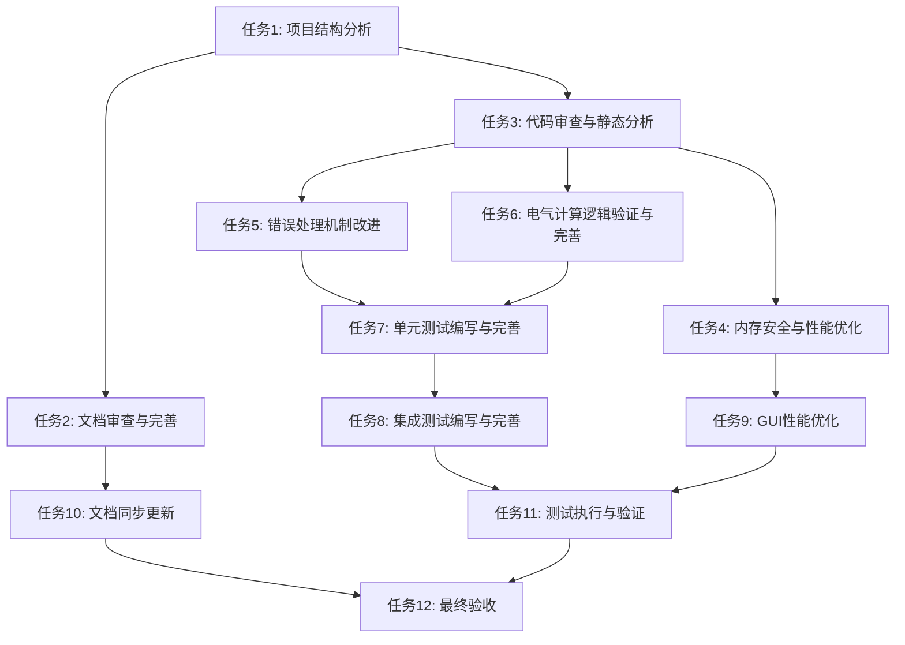

# 系统性完善工作 - 任务拆分文档

## 1. 子任务拆分

### 1.1 任务1: 项目结构分析

**输入契约:**
- 现有项目代码库
- 项目规则文档

**输出契约:**
- 项目结构分析报告
- 目录结构优化建议

**实现约束:**
- 使用Rust标准目录结构规范
- 遵循项目现有架构模式

**依赖关系:**
- 无前置任务
- 后置任务: 文档审查、代码审查

**测试用例设计:**
- 验证目录结构符合Rust项目标准
- 验证模块划分合理性

### 1.2 任务2: 文档审查与完善

**输入契约:**
- 现有项目文档
- 项目规则文档
- 项目结构分析报告

**输出契约:**
- 完整的项目说明文档
- 更新后的各模块文档
- 文档审查报告

**实现约束:**
- 文档格式符合Markdown规范
- 内容完整、准确、一致

**依赖关系:**
- 前置任务: 项目结构分析
- 后置任务: 文档同步更新

**测试用例设计:**
- 验证文档完整性
- 验证文档与代码的一致性
- 验证文档格式规范性

### 1.3 任务3: 代码审查与静态分析

**输入契约:**
- 项目源代码
- 项目规则文档

**输出契约:**
- 代码审查报告
- `cargo clippy`检查结果
- `cargo fmt`格式化报告

**实现约束:**
- 遵循Rust语言规范
- 确保内存安全和错误处理

**依赖关系:**
- 前置任务: 项目结构分析
- 后置任务: 代码优化、错误处理改进

**测试用例设计:**
- 验证所有代码通过`cargo fmt`
- 验证所有代码通过`cargo clippy`无警告
- 验证代码风格一致性

### 1.4 任务4: 内存安全与性能优化

**输入契约:**
- 代码审查报告
- 性能分析结果

**输出契约:**
- 优化后的代码
- 性能改进报告
- 内存使用优化建议

**实现约束:**
- 避免不必要的克隆操作
- 合理使用Rust所有权模型
- 优化热点代码

**依赖关系:**
- 前置任务: 代码审查与静态分析
- 后置任务: 性能测试

**测试用例设计:**
- 验证内存使用减少
- 验证GUI响应性能提升
- 验证计算密集型操作性能

### 1.5 任务5: 错误处理机制改进

**输入契约:**
- 代码审查报告
- 现有错误处理代码

**输出契约:**
- 使用thiserror重定义的错误类型
- 改进的错误传播机制
- 详细的错误信息

**实现约束:**
- 使用thiserror宏定义错误类型
- 提供清晰的错误信息和解决方案
- 避免panic!，使用Result类型

**依赖关系:**
- 前置任务: 代码审查与静态分析
- 后置任务: 单元测试

**测试用例设计:**
- 验证错误类型定义正确
- 验证错误信息清晰有用
- 验证错误处理路径完整性

### 1.6 任务6: 电气计算逻辑验证与完善

**输入契约:**
- 现有电气计算代码
- 项目规则文档中的计算公式

**输出契约:**
- 验证后的电气计算代码
- 计算准确性测试报告
- 边界条件处理改进

**实现约束:**
- 公式必须符合行业标准
- 处理边界条件和异常情况
- 提供计算精度控制

**依赖关系:**
- 前置任务: 代码审查与静态分析
- 后置任务: 单元测试、集成测试

**测试用例设计:**
- 验证单相电流计算准确性
- 验证三相电流计算准确性
- 验证边界条件处理

### 1.7 任务7: 单元测试编写与完善

**输入契约:**
- 各模块源代码
- 电气计算验证结果
- 错误处理改进代码

**输出契约:**
- 完整的单元测试套件
- 测试覆盖率报告
- 边界条件测试用例

**实现约束:**
- 测试覆盖核心功能
- 包含正常、边界和异常情况
- 使用Rust测试框架

**依赖关系:**
- 前置任务: 电气计算逻辑验证、错误处理机制改进
- 后置任务: 集成测试、测试执行

**测试用例设计:**
- 验证各模块功能正确性
- 验证边界条件处理
- 验证异常情况处理

### 1.8 任务8: 集成测试编写与完善

**输入契约:**
- 单元测试结果
- 模块间接口定义
- 核心业务流程

**输出契约:**
- 集成测试套件
- 模块交互测试报告
- 端到端业务流程测试

**实现约束:**
- 测试模块间交互
- 测试完整业务流程
- 验证数据流正确性

**依赖关系:**
- 前置任务: 单元测试编写
- 后置任务: 测试执行

**测试用例设计:**
- 验证节点间连接逻辑
- 验证计算结果在节点间传递
- 验证完整项目加载和保存

### 1.9 任务9: GUI性能优化

**输入契约:**
- 现有GUI代码
- 性能分析结果

**输出契约:**
- 优化后的GUI代码
- 渲染性能改进报告
- 用户体验优化建议

**实现约束:**
- 遵循egui/eframe最佳实践
- 避免不必要的重绘
- 优化大型图的渲染

**依赖关系:**
- 前置任务: 内存安全与性能优化
- 后置任务: 性能测试

**测试用例设计:**
- 验证GUI响应时间
- 验证大量节点时的渲染性能
- 验证交互流畅度

### 1.10 任务10: 文档同步更新

**输入契约:**
- 代码修改记录
- 功能变更说明
- 完善后的文档

**输出契约:**
- 同步更新的文档
- 文档与代码一致性报告

**实现约束:**
- 文档内容与代码实现同步
- 保持文档格式规范

**依赖关系:**
- 前置任务: 文档审查与完善、代码优化
- 后置任务: 最终验收

**测试用例设计:**
- 验证文档与代码功能一致性
- 验证API文档准确性
- 验证更新及时性

### 1.11 任务11: 测试执行与验证

**输入契约:**
- 单元测试套件
- 集成测试套件
- 项目源代码

**输出契约:**
- 测试执行报告
- 问题修复记录
- 验证结果汇总

**实现约束:**
- 确保所有测试通过
- 验证功能完整性
- 记录并修复发现的问题

**依赖关系:**
- 前置任务: 单元测试编写、集成测试编写
- 后置任务: 最终验收

**测试用例设计:**
- 执行所有单元测试
- 执行所有集成测试
- 验证边界条件和异常处理

### 1.12 任务12: 最终验收

**输入契约:**
- 测试执行报告
- 代码修改记录
- 文档更新记录
- 项目规则文档

**输出契约:**
- 最终验收报告
- 合规性检查结果
- 项目完善总结

**实现约束:**
- 验证所有规范要求都已满足
- 确认功能完整性
- 评估代码质量

**依赖关系:**
- 前置任务: 文档同步更新、测试执行与验证
- 无后置任务

**测试用例设计:**
- 验证所有验收标准都已满足
- 确认项目可正常构建和运行
- 评估整体质量和合规性

## 2. 任务依赖图

## 3. 任务执行优先级

1. 任务1: 项目结构分析 (最高优先级)
2. 任务2: 文档审查与完善
3. 任务3: 代码审查与静态分析
4. 任务6: 电气计算逻辑验证与完善
5. 任务5: 错误处理机制改进
6. 任务7: 单元测试编写与完善
7. 任务8: 集成测试编写与完善
8. 任务4: 内存安全与性能优化
9. 任务9: GUI性能优化
10. 任务11: 测试执行与验证
11. 任务10: 文档同步更新
12. 任务12: 最终验收 (最低优先级)

## 4. 任务执行计划

| 任务ID | 任务名称 | 预计工作量 | 预计开始时间 | 预计完成时间 |
|--------|---------|------------|--------------|--------------|
| T1     | 项目结构分析 | 1天 | 第1天 | 第1天 |
| T2     | 文档审查与完善 | 2天 | 第2天 | 第3天 |
| T3     | 代码审查与静态分析 | 2天 | 第2天 | 第3天 |
| T6     | 电气计算逻辑验证与完善 | 2天 | 第4天 | 第5天 |
| T5     | 错误处理机制改进 | 2天 | 第4天 | 第5天 |
| T7     | 单元测试编写与完善 | 3天 | 第6天 | 第8天 |
| T8     | 集成测试编写与完善 | 2天 | 第9天 | 第10天 |
| T4     | 内存安全与性能优化 | 2天 | 第9天 | 第10天 |
| T9     | GUI性能优化 | 1天 | 第11天 | 第11天 |
| T11    | 测试执行与验证 | 2天 | 第12天 | 第13天 |
| T10    | 文档同步更新 | 1天 | 第14天 | 第14天 |
| T12    | 最终验收 | 1天 | 第15天 | 第15天 |