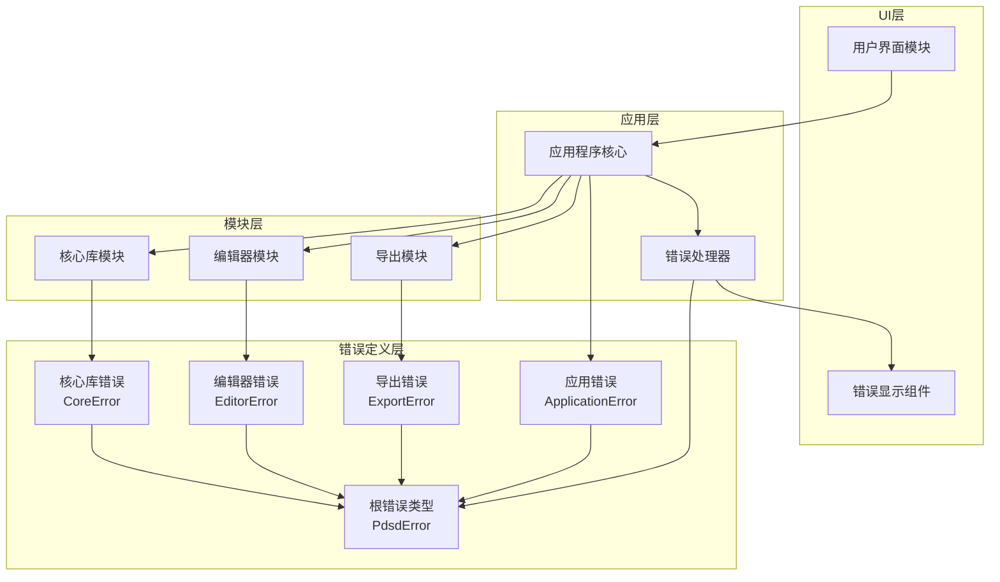
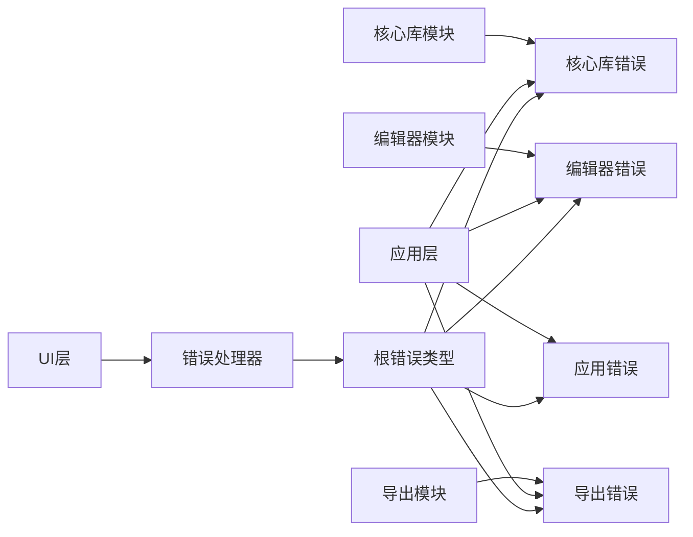
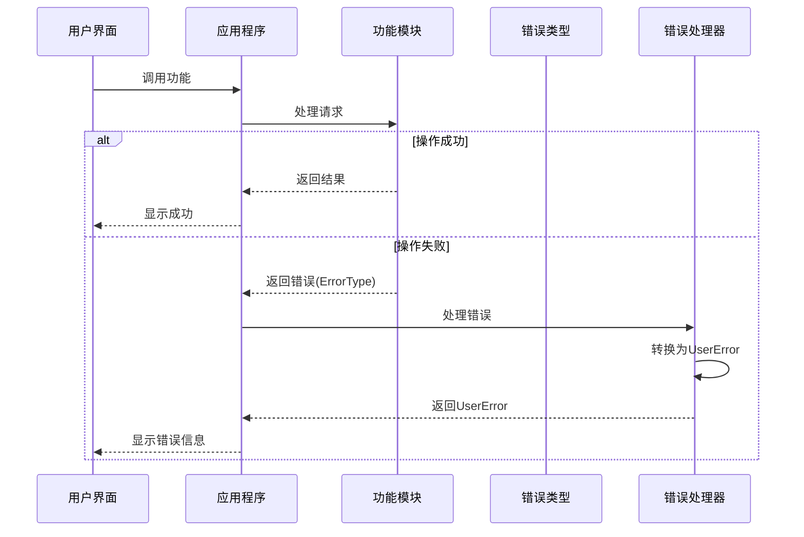

# 任务5：错误处理机制改进 - 设计文档

## 1. 整体架构图



## 2. 分层设计和核心组件

### 2.1 错误定义层

错误定义层是整个错误处理系统的基础，包含所有错误类型的定义：

1. **根错误类型 (PdsdError)**
   - **职责**：作为所有错误的聚合点，提供统一的错误处理入口
   - **位置**：`src/error.rs`
   - **核心功能**：聚合所有模块特定的错误类型

2. **模块特定错误类型**
   - **CoreError**：核心库错误，位于`src/core_lib/error.rs`
   - **EditorError**：编辑器错误，位于`src/editor/error.rs`
   - **ExportError**：导出功能错误，位于`src/export/error.rs`
   - **ApplicationError**：应用程序错误，位于`src/application/error.rs`

### 2.2 模块层错误处理

每个模块负责定义自己的错误类型并在其功能中使用：

1. **核心库错误处理**
   - 计算相关错误
   - 数据验证错误
   - 配置错误

2. **编辑器错误处理**
   - 节点操作错误
   - 连接错误
   - UI状态错误

3. **导出模块错误处理**
   - 文件操作错误
   - 格式转换错误
   - 资源访问错误

4. **应用程序错误处理**
   - 初始化错误
   - 配置错误
   - 状态管理错误

### 2.3 应用层错误处理

应用层负责统一错误处理和转换：

1. **错误处理器 (ErrorHandler)**
   - **职责**：接收、处理和转换错误
   - **核心功能**：
     - 错误分类和优先级判断
     - 错误日志记录
     - 错误转换为用户友好消息
     - 提供错误恢复建议

### 2.4 UI层错误展示

UI层负责将错误信息以用户友好的方式展示：

1. **错误显示组件**
   - **职责**：在界面上展示错误信息
   - **核心功能**：
     - 显示错误标题和详细信息
     - 提供操作建议
     - 支持复制错误详情（用于调试）
     - 提供错误报告选项

## 3. 模块依赖关系图



## 4. 接口契约定义

### 4.1 错误类型接口

```rust
// 根错误类型定义接口
#[derive(Debug, Error)]
enum PdsdError {
    #[error(transparent)]
    Core(#[from] CoreError),
    
    #[error(transparent)]
    Editor(#[from] EditorError),
    
    #[error(transparent)]
    Export(#[from] ExportError),
    
    #[error(transparent)]
    Application(#[from] ApplicationError),
    
    #[error(transparent)]
    Io(#[from] std::io::Error),
    
    #[error(transparent)]
    Serde(#[from] serde_json::Error),
    
    #[error("未知错误: {0}")]
    Unknown(String),
}

// 模块错误类型接口示例
#[derive(Debug, Error)]
enum CoreError {
    #[error("计算错误: {0}")]
    Calculation(String),
    
    #[error("验证错误: {field}: {message}")]
    Validation {
        field: String,
        message: String,
    },
    
    #[error("配置错误: {0}")]
    Configuration(String),
}
```

### 4.2 错误处理器接口

```rust
struct ErrorHandler {
    // 内部状态
}

impl ErrorHandler {
    fn new() -> Self { ... }
    
    // 处理错误并转换为用户消息
    fn handle_error(&self, error: &PdsdError) -> UserError {
        // 实现错误处理逻辑
    }
    
    // 记录错误日志
    fn log_error(&self, error: &PdsdError, context: &str) {
        // 实现日志记录
    }
    
    // 获取错误的恢复建议
    fn get_recovery_suggestions(&self, error: &PdsdError) -> Vec<String> {
        // 提供恢复建议
    }
}
```

### 4.3 用户错误接口

```rust
struct UserError {
    title: String,
    message: String,
    details: Option<String>,
    severity: ErrorSeverity,
    suggestions: Vec<String>,
}

enum ErrorSeverity {
    Info,
    Warning,
    Error,
    Critical,
}

impl UserError {
    fn new(title: String, message: String) -> Self { ... }
    
    fn with_details(mut self, details: String) -> Self { ... }
    
    fn with_severity(mut self, severity: ErrorSeverity) -> Self { ... }
    
    fn with_suggestion(mut self, suggestion: String) -> Self { ... }
}
```

## 5. 数据流向图



## 6. 异常处理策略

### 6.1 错误转换策略

1. **内部错误转换**
   - 使用`thiserror`的`#[from]`属性自动转换底层错误
   - 使用`map_err`和`with_context`添加额外上下文
   - 确保保留原始错误信息以便调试

2. **用户错误转换**
   - 基于错误类型和上下文提供适当的用户消息
   - 对技术细节进行抽象，提供用户可理解的描述
   - 为常见错误提供具体的解决建议

### 6.2 错误日志策略

1. **日志级别**
   - 致命错误: ERROR级别
   - 功能错误: WARN级别
   - 验证错误: INFO级别
   - 调试信息: DEBUG级别

2. **日志内容**
   - 错误类型和消息
   - 发生位置（模块、函数）
   - 相关上下文信息
   - 可能的原因和解决方法

### 6.3 错误恢复策略

1. **自动恢复**
   - 对非致命错误尝试自动恢复
   - 使用默认值或回滚操作

2. **用户干预**
   - 对需要用户决策的错误提供明确的操作选项
   - 支持重试、跳过或取消操作

## 7. 实现路径

### 7.1 第一阶段：错误类型定义

1. 创建`src/error.rs`定义根错误类型
2. 为每个模块创建错误类型文件
3. 定义错误变体和转换规则

### 7.2 第二阶段：错误处理基础设施

1. 实现错误处理器
2. 创建用户错误转换逻辑
3. 设置错误日志机制

### 7.3 第三阶段：模块改造

1. 按优先级改造各模块：
   - core_lib模块
   - application模块
   - editor模块
   - export模块

2. 每个模块改造步骤：
   - 将panic!替换为Result返回
   - 实现错误传播
   - 添加错误上下文
   - 编写单元测试

### 7.4 第四阶段：UI集成

1. 实现错误显示组件
2. 集成错误处理器到UI流程
3. 测试错误显示和用户交互

## 8. 验证方法

1. **单元测试**
   - 测试错误创建和转换
   - 测试错误传播机制
   - 测试边界条件

2. **集成测试**
   - 测试跨模块错误传播
   - 测试错误处理器功能
   - 测试UI错误显示

3. **静态分析**
   - 使用Clippy检查错误处理最佳实践
   - 检查未处理的Result和潜在的panic!