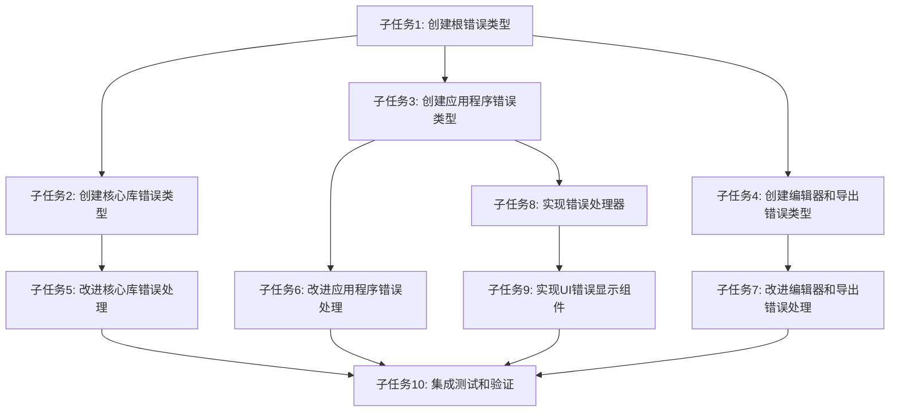

# 任务5：错误处理机制改进 - 任务分解文档

## 1. 任务拆分概述

根据设计文档，我们将错误处理机制改进任务拆分为以下原子化子任务，每个子任务都具有明确的输入、输出和验收标准。

## 2. 子任务定义

### 2.1 子任务1：创建根错误类型

**输入契约**：
- 项目现有代码结构
- Rust和thiserror库知识

**输出契约**：
- 文件：`src/error.rs`
- 包含PdsdError根错误类型定义
- 基本错误转换功能

**实现约束**：
- 使用thiserror宏定义错误类型
- 支持从标准库错误和第三方库错误转换
- 提供足够的文档注释

**依赖关系**：
- 无前置依赖
- 所有后续子任务依赖此任务

**测试用例**：
- 验证错误创建和转换功能
- 验证错误显示格式

### 2.2 子任务2：创建核心库错误类型

**输入契约**：
- 已完成的根错误类型
- core_lib模块的功能和错误场景分析

**输出契约**：
- 文件：`src/core_lib/error.rs`
- CoreError枚举定义
- 与根错误类型的集成

**实现约束**：
- 错误类型覆盖计算、验证、配置等场景
- 提供详细的错误信息和上下文
- 支持与根错误类型的转换

**依赖关系**：
- 前置依赖：子任务1
- 后置依赖：子任务5、子任务7

**测试用例**：
- 测试不同错误场景的创建
- 测试错误转换为根错误类型

### 2.3 子任务3：创建应用程序错误类型

**输入契约**：
- 已完成的根错误类型
- application模块的功能和错误场景分析

**输出契约**：
- 文件：`src/application/error.rs`
- ApplicationError枚举定义
- 与根错误类型的集成

**实现约束**：
- 错误类型覆盖初始化、配置、状态管理等场景
- 提供足够的上下文信息

**依赖关系**：
- 前置依赖：子任务1
- 后置依赖：子任务6、子任务8

**测试用例**：
- 测试不同错误场景的创建和转换

### 2.4 子任务4：创建编辑器和导出错误类型

**输入契约**：
- 已完成的根错误类型
- editor和export模块的功能和错误场景分析

**输出契约**：
- 文件：`src/editor/error.rs`
- 文件：`src/export/error.rs`
- EditorError和ExportError枚举定义
- 与根错误类型的集成

**实现约束**：
- EditorError覆盖节点操作、连接、UI状态等错误
- ExportError覆盖文件操作、格式转换等错误

**依赖关系**：
- 前置依赖：子任务1
- 后置依赖：子任务7、子任务9

**测试用例**：
- 测试不同错误场景的创建和转换

### 2.5 子任务5：改进核心库错误处理

**输入契约**：
- 已完成的CoreError错误类型
- core_lib模块的现有代码

**输出契约**：
- 更新后的core_lib模块代码
- 所有函数返回Result类型而非panic!
- 适当的错误上下文和传播

**实现约束**：
- 优先处理algorithm子模块
- 使用?操作符简化错误传播
- 为错误添加适当的上下文信息

**依赖关系**：
- 前置依赖：子任务2
- 后置依赖：子任务10

**测试用例**：
- 验证错误处理路径
- 验证错误传播正确性

### 2.6 子任务6：改进应用程序错误处理

**输入契约**：
- 已完成的ApplicationError错误类型
- application模块的现有代码

**输出契约**：
- 更新后的application模块代码
- 所有函数返回Result类型而非panic!
- 适当的错误上下文和传播

**实现约束**：
- 重点改进app.rs和state.rs
- 确保与UI层正确集成

**依赖关系**：
- 前置依赖：子任务3
- 后置依赖：子任务10

**测试用例**：
- 验证应用启动和运行过程中的错误处理

### 2.7 子任务7：改进编辑器和导出模块错误处理

**输入契约**：
- 已完成的EditorError和ExportError错误类型
- editor和export模块的现有代码

**输出契约**：
- 更新后的editor和export模块代码
- 所有函数返回Result类型而非panic!
- 适当的错误上下文和传播

**实现约束**：
- 确保错误处理不影响UI响应性
- 对文件操作错误提供详细信息

**依赖关系**：
- 前置依赖：子任务4
- 后置依赖：子任务10

**测试用例**：
- 测试编辑器操作中的错误处理
- 测试导出功能的错误处理

### 2.8 子任务8：实现错误处理器

**输入契约**：
- 所有错误类型定义
- 错误处理设计规范

**输出契约**：
- 文件：`src/error_handler.rs`
- ErrorHandler结构体实现
- 错误转换和处理功能

**实现约束**：
- 支持错误分类和优先级判断
- 提供用户友好的错误消息转换
- 支持错误日志记录

**依赖关系**：
- 前置依赖：子任务1、子任务3
- 后置依赖：子任务9

**测试用例**：
- 测试不同错误类型的处理
- 测试用户错误转换

### 2.9 子任务9：实现UI错误显示组件

**输入契约**：
- 已实现的错误处理器
- egui框架知识
- UI设计规范

**输出契约**：
- 文件：`src/editor/ui/error_display.rs`
- 错误显示组件实现
- 与错误处理器的集成

**实现约束**：
- 提供清晰的错误信息展示
- 支持复制错误详情
- 提供操作建议

**依赖关系**：
- 前置依赖：子任务4、子任务8
- 后置依赖：子任务10

**测试用例**：
- 测试不同类型错误的显示
- 测试用户交互功能

### 2.10 子任务10：集成测试和验证

**输入契约**：
- 所有已完成的子任务
- 项目现有测试框架

**输出契约**：
- 集成测试套件
- 验证报告
- 代码覆盖率统计

**实现约束**：
- 覆盖所有主要错误场景
- 验证错误传播路径
- 验证UI错误显示

**依赖关系**：
- 前置依赖：子任务5、子任务6、子任务7、子任务9
- 无后置依赖

**测试用例**：
- 端到端错误处理流程测试
- 边界条件和异常情况测试

## 3. 任务依赖图

## 4. 复杂度评估

| 子任务 | 复杂度 | 估计工作量 | 风险级别 |
|-------|-------|----------|--------|
| 子任务1 | 低 | 0.5天 | 低 |
| 子任务2 | 中 | 1天 | 低 |
| 子任务3 | 中 | 1天 | 低 |
| 子任务4 | 中 | 1天 | 低 |
| 子任务5 | 中高 | 1.5天 | 中 |
| 子任务6 | 中高 | 1.5天 | 中 |
| 子任务7 | 中高 | 1.5天 | 中 |
| 子任务8 | 中 | 1天 | 低 |
| 子任务9 | 中 | 1天 | 低 |
| 子任务10 | 中高 | 2天 | 中 |

**总计**：约12天工作量（考虑并行执行）

## 5. 验收标准汇总

### 5.1 代码质量标准
- 所有代码通过`cargo check`编译检查
- 所有代码通过`cargo clippy --all --all-features`检查，无警告
- 代码符合Rust风格规范（通过`cargo fmt`验证）
- 错误类型和处理函数有完整的文档注释

### 5.2 功能验收标准
- 核心库中不再使用panic!，所有错误返回Result类型
- 应用程序能正确捕获和处理所有可能的错误
- UI能以用户友好的方式显示错误信息
- 错误信息包含足够的上下文，便于调试

### 5.3 性能标准
- 错误处理不会明显影响应用程序性能
- 错误日志记录机制高效且不会导致性能问题

### 5.4 测试标准
- 单元测试覆盖率≥80%
- 集成测试覆盖所有主要错误场景
- 测试用例包含正常流程、边界条件和异常情况

## 6. 资源需求

- 开发人员：1名熟悉Rust和错误处理最佳实践的工程师
- 工具：
  - Rust开发环境
  - Cargo工具链
  - 代码编辑器（推荐VSCode + Rust Analyzer）
- 文档资源：
  - thiserror库文档
  - Rust错误处理最佳实践指南